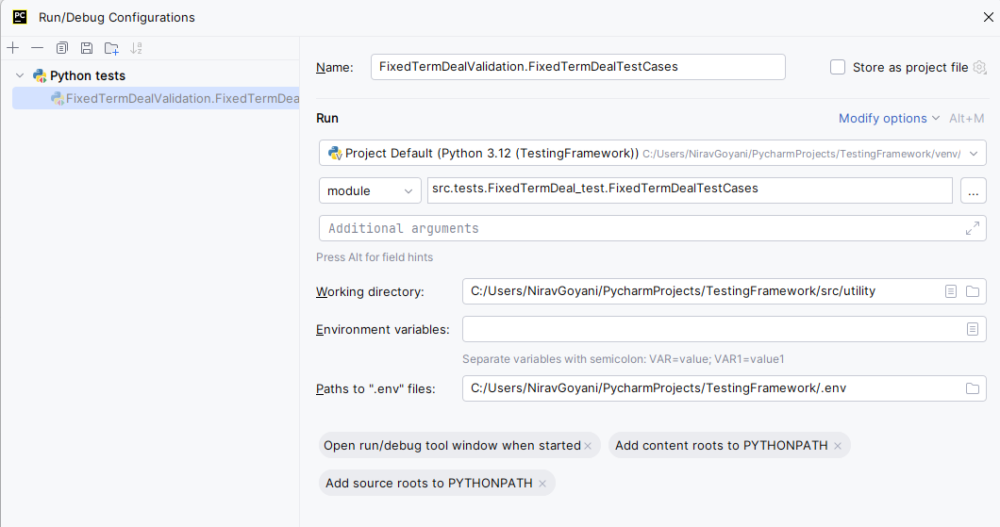

# Introduction 
This testing framework is designed to validate output data from SharePoint using Python. It leverages various Python libraries to streamline the process of data extraction and validation.

# Features
- Data Extraction: Connects to SharePoint to retrieve data.
- Data Validation: Validates the retrieved data against predefined rules and criteria.
- Report Generation: Generates comprehensive reports summarizing the validation results.
- Logging: Detailed logging of the testing process for troubleshooting and analysis.

# Prerequisites
- Python 3.8 or higher
- Access to the SharePoint site
- Required Python libraries (detailed below)

# Installation
Clone the Repository:
```
git clone <repository-url>
cd <repository-directory>
```

Install Dependencies:
Install the required Python libraries using pip:
`pip install -r requirements.txt`

# To run Test: 
- From Terminal: <br/>
 `python src/tests/RunAllTest.py`

- Or Configuration to run the test:
<br/><br/>
Change the working directory to new path to "src/utility" <br/>
Add the path to .env file "../.env"

# Dependencies
The framework requires the following Python libraries:
- Office365-REST-Python-Client: For data extraction from sharepoint
- openpyxl: For working with Excel files.
- django-environ: To get the credentials from the .evn file
- html-testRunner: To generate HTMl report
